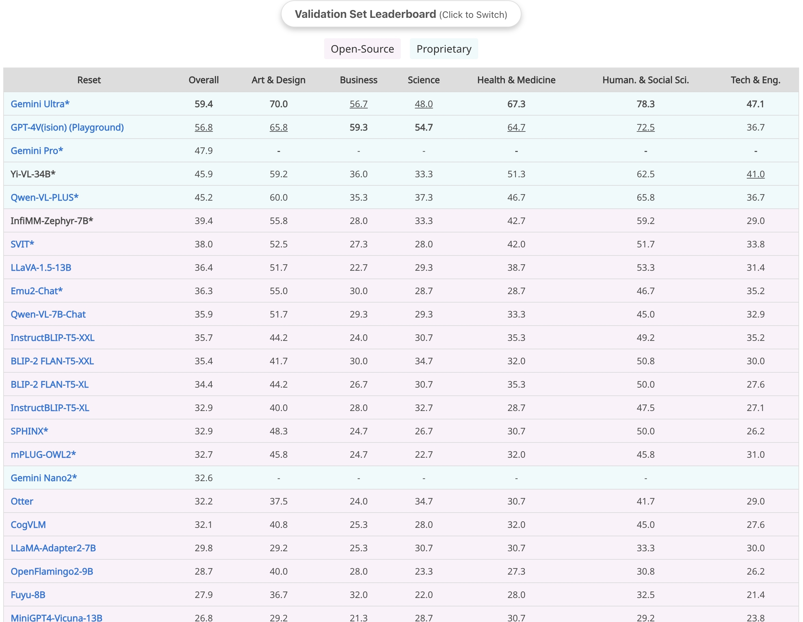
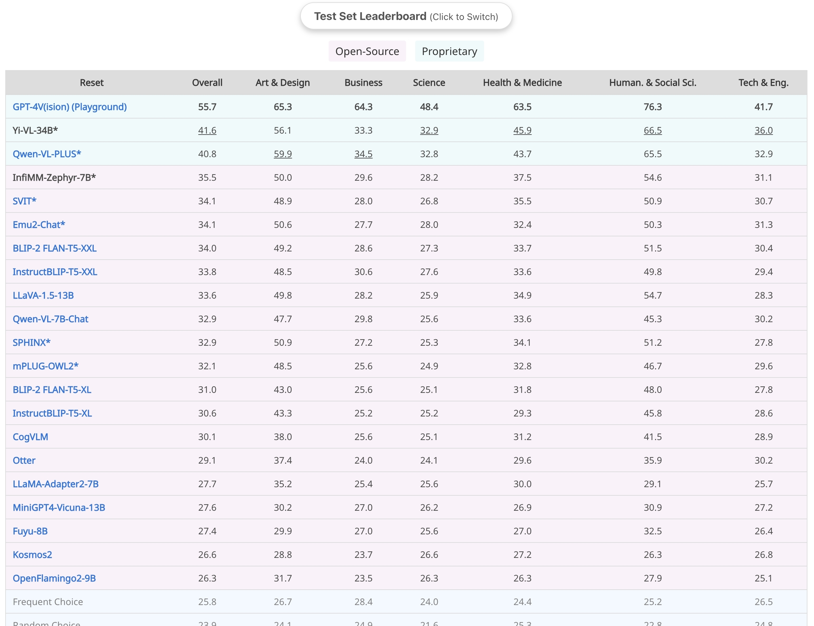

<br>
<p align="center">
  </a>
</p>
<br>

# InfiMM

InfiMM, inspired by the Flamingo architecture, sets itself apart with unique training data and diverse large language models (LLMs). This approach allows InfiMM to maintain the core strengths of Flamingo while offering enhanced capabilities. As the premier open-sourced variant in this domain, InfiMM excels in accessibility and adaptability, driven by community collaboration. It's more than an emulation of Flamingo; it's an innovation in visual language processing.

Our model is another attempt to produce the result reported in the paper "Flamingo: A Large-scale Visual Language Model for Multimodal Understanding" by DeepMind.
Compared with previous open-sourced attempts ([OpenFlamingo](https://github.com/mlfoundations/open_flamingo) and [IDEFIC](https://huggingface.co/blog/idefics)), InfiMM offers a more flexible models, allowing for a wide range of applications.
In particular, InfiMM integrates the latest LLM models into VLM domain the reveals the impact of LLMs with different scales and architectures.

Please note that InfiMM is currently in beta stage and we are continuously working on improving it.

## Model Details

- **Developed by**: Institute of Automation, Chinese Academy of Sciences and ByteDance
- **Model Type**: Visual Language Model (VLM)
- **Language**: English
- **LLMs**: [Zephyr](https://huggingface.co/HuggingFaceH4/zephyr-7b-beta), [LLaMA2-13B](https://ai.meta.com/llama/), [Vicuna-13B](https://huggingface.co/lmsys/vicuna-13b-v1.5)
- **Vision Model**: [EVA CLIP](https://huggingface.co/QuanSun/EVA-CLIP)
- **Language(s) (NLP):** en
- **License:** see [License section](#license)
<!---
- **Parent Models:** [QuanSun/EVA-CLIP](https://huggingface.co/QuanSun/EVA-CLIP/blob/main/EVA02_CLIP_L_336_psz14_s6B.pt) and [HuggingFaceH4/zephyr-7b--beta ta](https://huggingface.co/HuggingFaceH4/zephyr-7b-beta)
  -->

## Model Family

Our model consists of several different model. Please see the details below.
| Model                  | LLM            | Vision Encoder | IFT |
| ---------------------- | -------------- | -------------- | --- |
| InfiMM-Zephyr          | Zehpyr-7B-beta | ViT-L-336      | No  |
| InfiMM-Llama-13B       | Llama2-13B     | ViT-G-224      | No  |
| InfiMM-Vicuna-13B      | Vicuna-13B     | ViT-E-224      | No  |
| InfiMM-Zephyr-Chat     | Zehpyr-7B-beta | ViT-L-336      | Yes |
| InfiMM-Llama-13B-Chat  | Llama2-13B     | ViT-G-224      | Yes |
| InfiMM-Vicuna-13B-Chat | Vicuna-13B     | ViT-E-224      | Yes |

<!-- InfiMM-Zephyr-Chat is an light-weighted, open-source re-production of Flamingo-style Multimodal large language models with chat capability that takes sequences of interleaved images and texts as inputs and generates text outputs, with only 9B parameters.
-->

## Demo

Will be released soon.

Our model adopts the Flamingo architecture, leveraging EVA CLIP as the visual encoder and employing LLaMA2, Vicuna, and Zephyr as language models. The visual and language modalities are connected through a Cross Attention module.

## Quickstart

Use the code below to get started with the base model:
```python
import torch
from transformers import AutoModelForCausalLM, AutoProcessor


processor = AutoProcessor.from_pretrained("InfiMM/infimm-zephyr", trust_remote_code=True)

prompts = [
    {
        "role": "user",
        "content": [
            {"image": "assets/infimm-logo.webp"},
            "Please explain this image to me.",
        ],
    }
]
inputs = processor(prompts)

# use bf16
model = AutoModelForCausalLM.from_pretrained(
    "InfiMM/infimm-zephyr",
    local_files_only=True,
    torch_dtype=torch.bfloat16,
    trust_remote_code=True,
).eval()


inputs = inputs.to(model.device)
inputs["batch_images"] = inputs["batch_images"].to(torch.bfloat16)
generated_ids = model.generate(
    **inputs,
    min_generation_length=0,
    max_generation_length=256,
)
generated_text = processor.batch_decode(generated_ids, skip_special_tokens=True)
print(generated_text)
```

## Training Details

We employed three stages to train our model: pretraining (PT), multi-task training (MTT), and instruction finetuning (IFT). Refer to the table below for detailed configurations in each stage. Due to significant noise in the pretraining data, we aimed to enhance the model's accuracy by incorporating higher-quality data. In the multi-task training (MTT) phase, we utilized substantial training data from diverse datasets. However, as the answer in these data mainly consisted of single words or phrases, the model's conversational ability was limited. Therefore, in the third stage, we introduced a considerable amount of image-text dialogue data (llava665k) for fine-tuning the model's instructions.

### Pretraining (PT)

We follow similar training procedures used in [IDEFICS](https://huggingface.co/HuggingFaceM4/idefics-9b-instruct/blob/main/README.md).

The model is trained on a mixture of image-text pairs and unstructured multimodal web documents. All data are from public sources. Many image URL links are expired, we are capable of only downloading partial samples. We filter low quality data, here are resulting data we used:

| Data Source                                                      | Type of Data                          | Number of Tokens in Source | Number of Images in Source | Number of Samples | Epochs |
| ---------------------------------------------------------------- | ------------------------------------- | -------------------------- | -------------------------- | ----------------- | ------ |
| [OBELICS](https://huggingface.co/datasets/HuggingFaceM4/OBELICS) | Unstructured Multimodal Web Documents | -                          | -                          | 101M              | 1      |
| [MMC4](https://github.com/allenai/mmc4)                          | Unstructured Multimodal Web Documents | -                          | -                          | 53M               | 1      |
| [LAION](https://huggingface.co/datasets/laion/laion2B-en)        | Image-Text Pairs                      | -                          | 115M                       | 115M              | 1      |
| [COYO](https://github.com/kakaobrain/coyo-dataset)               | Image-Text Pairs                      | -                          | 238M                       | 238M              | 1      |
| [LAION-COCO](https://laion.ai/blog/laion-coco/)                  | Image-Text Pairs                      | -                          | 140M                       | 140M              | 1      |
| [PMD\*](https://huggingface.co/datasets/facebook/pmd)            | Image-Text Pairs                      | -                          | 20M                        | 1                 |

\*PMD is only used in models with 13B LLMs, not the 7B Zephyr model.

During pretraining of interleaved image text sample, we apply masked cross-attention, however, we didn't strictly follow Flamingo, which alternate attention of image to its previous text or later text by change of 0.5.

We use the following hyper parameters:
| Categories               | Parameters                 | Value                |
| ------------------------ | -------------------------- | -------------------- |
| Perceiver Resampler      | Number of Layers           | 6                    |
|                          | Number of Latents          | 64                   |
|                          | Number of Heads            | 16                   |
|                          | Resampler Head Dimension   | 96                   |
| Training                 | Sequence Length            | 384 (13B) / 792 (7B) |
|                          | Effective Batch Size       | 40\*128              |
|                          | Max Images per Sample      | 6                    |
|                          | Weight Decay               | 0.1                  |
|                          | Optimizer                  | Adam(0.9, 0.999)     |
|                          | Gradient Accumulation Step | 2                    |
| Learning Rate            | Initial Max                | 1e-4                 |
|                          | Decay Schedule             | Constant             |
|                          | Warmup Step rate           | 0.005                |
| Large-scale Optimization | Gradient Checkpointing     | False                |
|                          | Precision                  | bf16                 |
|                          | ZeRO Optimization          | Stage 2              |

### Multi-Task Training (MTT)

Here we use mix_cap_vqa to represent the mixed training set from COCO caption, TextCap, VizWiz Caption, VQAv2, OKVQA, VizWiz VQA, TextVQA, OCRVQA, STVQA, DocVQA, GQA and ScienceQA-image. For caption, we add prefix such as "Please describe the image." before the question. And for QA, we add "Answer the question using a single word or phrase.". Specifically, for VizWiz VQA, we use "When the provided information is insufficient, respond with 'Unanswerable'. Answer the question using a single word or phrase.". While for ScienceQA-image, we use "Answer with the option's letter from the given choices directly."

### Instruction Fine-Tuning (IFT)

For instruction fine-tuning stage, we use the recently released [LLaVA-MIX-665k](https://huggingface.co/datasets/liuhaotian/LLaVA-Instruct-150K/tree/main).

We use the following hyper parameters:
| Categories               | Parameters                 | Value                |
| ------------------------ | -------------------------- | -------------------- |
| Perceiver Resampler      | Number of Layers           | 6                    |
|                          | Number of Latents          | 64                   |
|                          | Number of Heads            | 16                   |
|                          | Resampler Head Dimension   | 96                   |
| Training                 | Sequence Length            | 384 (13B) / 792 (7B) |
|                          | Effective Batch Size       | 64                   |
|                          | Max Images per Sample      | 6                    |
|                          | Weight Decay               | 0.1                  |
|                          | Optimizer                  | Adam(0.9, 0.999)     |
|                          | Gradient Accumulation Step | 2                    |
| Learning Rate            | Initial Max                | 1e-5                 |
|                          | Decay Schedule             | Constant             |
|                          | Warmup Step rate           | 0.005                |
| Large-scale Optimization | Gradient Checkpointing     | False                |
|                          | Precision                  | bf16                 |
|                          | ZeRO Optimization          | Stage 2              |

During IFT, similar to pretrain, we keep ViT and LLM frozen for both chat-based LLM (Vicuna and Zephyr). For Llama model, we keep LLM trainable during the IFT stage. We also apply chat-template to process the training samples.

## Evaluation

### PreTraining Evaluation

We evaluate the pretrained models on the following downstream tasks: Image Captioning and VQA. We also compare with our results with [IDEFICS](https://huggingface.co/blog/idefics).

| Model             | Shots | COCO CIDEr | Flickr30K CIDEr | VQA v2 Acc | TextVQA Acc | OK-VQA Acc |
| ----------------- | ----- | ---------- | --------------- | ---------- | ----------- | ---------- |
| IDEFICS-9B        | 0     | 46         | 27.3            | 50.9       | 25.9        | 38.4       |
|                   | 4     | 93         | 59.7            | 55.4       | 27.6        | 45.5       |
| IDEFICS-80B       | 0     | 91.8       | 53.7            | 60         | 30.9        | 45.2       |
|                   | 4     | 110.3      | 73.7            | 64.6       | 34.4        | 52.4       |
| InfiMM-Zephyr-7B  | 0     | 78.8       | 60.7            | 33.7       | 15.2        | 17.1       |
|                   | 4     | 108.6      | 71.9            | 59.1       | 34.3        | 50.5       |
| InfiMM-Llama2-13B | 0     | 85.4       | 54.6            | 51.6       | 24.2        | 26.4       |
|                   | 4     | 125.2      | 87.1            | 66.1       | 38.2        | 55.5       |
| InfiMM-Vicuna13B  | 0     | 69.6       | 49.6            | 60.4       | 32.8        | 49.2       |
|                   | 4     | 118.1      | 81.4            | 64.2       | 38.4        | 53.7       |

### IFT Evaluation

In our analysis, we concentrate on two primary benchmarks for evaluating MLLMs: 1) Multi-choice Question Answering (QA) and 2) Open-ended Evaluation. We've observed that the evaluation metrics for tasks like Visual Question Answering (VQA) and Text-VQA are overly sensitive to exact answer matches. This approach can be misleading, particularly when models provide synonymous but technically accurate responses. Therefore, these metrics have been omitted from our comparison for a more precise assessment. The evaluation results are shown in the table below.

| Model               | ScienceQA-Img | MME                   | MM-VET | InfiMM-Eval  | MMbench | MMMU-Val | MMMU-Test |
| ------------------- | ------------- | --------------------- | ------ | ------------ | ------- | -------- | --------- |
| Otter-9B            | -             | 1292/306              | 24.6   | 32.2         | -       | 22.69    | -         |
| IDEFICS-9B-Instruct | 60.6          | -/-                   | -      | -            | -       | 24.53    | -         |
| InfiMM-Zephyr-7B    | 71.1          | P: 1406<br>C:327      | 32.8   | 36.0         | 59.7    | 39.4     | 35.5      |
| InfiMM-Llama-13b    | 73.0          | P: 1444.5<br>C: 337.6 | 39.2   | 0.4559/0.414 | 66.4    | 39.1     | 35.2      |
| InfiMM-Vicuna-13B   | 74.0          | P: 1461.2<br>C: 323.5 | 36.0   | 40.0         | 66.7    | 37.6     | 34.6      |

<!--
| Model             | TextVQA (no ocr) | OK-VQA | VQAv2 | ScienceQA-Img | GQA  | MME                   | MM-VET | MMMU | InfiMM-Eval  | MMbench |
| ----------------- | ---------------- | ------ | ----- | ------------- | ---- | --------------------- | ------ | ---- | ------------ | ------- |
| InfiMM-Zephyr-7B  | 36.7             | 55.4   | /     | 71.1          |      | P: 1406<br>C:327      | 32.8   | 39.4 | 36.0         | 59.7    |
| InfiMM-Llama-13b  | 44.6             | 62.3   | 78.5  | 73.0          | 61.2 | P: 1444.5<br>C: 337.6 | 39.2   | 39.1 | 0.4559/0.414 | 66.4    |
| InfiMM-Vicuna-13B | 41.7             | 58.5   | 73.0  | 74.0          | 58.5 | P: 1461.2<br>C: 323.5 | 36.0   | 37.6 | 40.0         | 66.7    |

We select checkpoint after 1 epoch instruction fine-tuning.

| Model               | <nobr>ScienceQA <br>acc.</nobr> | <nobr>MME <br>P/C</nobr> | <nobr>MM-Vet</nobr> | <nobr>InfiMM-Eval</nobr> | <nobr>MMMU (val)</nobr> |
| :------------------ | ------------------------------: | -----------------------: | ------------------: | -----------------------: | ----------------------: |
| Otter-9B            |                               - |                 1292/306 |                24.6 |                    22.69 |                    32.2 |
| IDEFICS-9B-Instruct |                            60.6 |                      -/- |                   - |                    24.53 |                       - |
| InfiMM-Zephyr-Chat  |                           71.14 |                 1406/327 |                33.3 |                    35.97 |                    39.4 |
-->

<details>
<summary>Leaderboard Details</summary>


<br>MMMU-Val split results<br>

<br>MMMU-Test split results<br>

</details>

## Citation

```latex
@misc{InfiMM,
      title={InfiMM: Advancing Multimodal Understanding from Flamingo's Legacy through Diverse LLM Integration},
      author={InfiMM Team},
      url={https://huggingface.co/Infi-MM/},
      year={2024}
}
```

## License

<a href="https://creativecommons.org/licenses/by-nc/4.0/deed.en">
	
</a>

This project is licensed under the **CC BY-NC 4.0**.

The copyright of the images belongs to the original authors.

See [LICENSE](LICENSE) for more information.

## Contact Us

Please feel free to contact us via email [infimmbytedance@gmail.com](infimmbytedance@gmail.com) if you have any questions.
